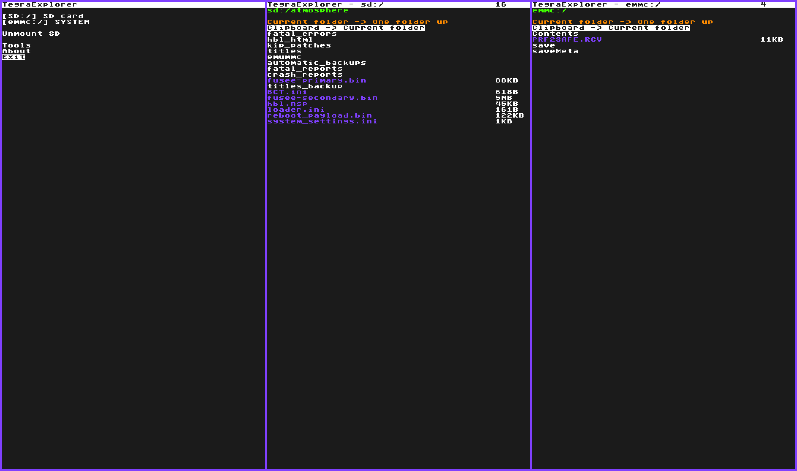

# TegraExplorer
A payload-based file explorer for your switch!

## Usage
1. Get your favorite payload injector
2. Inject TegraExplorer as a payload

Navigate around the menu's using the vol+, vol- and power buttons

## Functions
- Navigate the SD card
- Navigate the System partition of your sysnand
- Deleting, copying or moving files
- Launching payloads
- Dumping your current firmware to sd

## Screenshot 

# Credits
Based on [Lockpick_RCM](https://github.com/shchmue/Lockpick_RCM), and thus based on [Hekate](https://github.com/CTCaer/hekate)

Lots of help from:
- shchmue
- Denn
